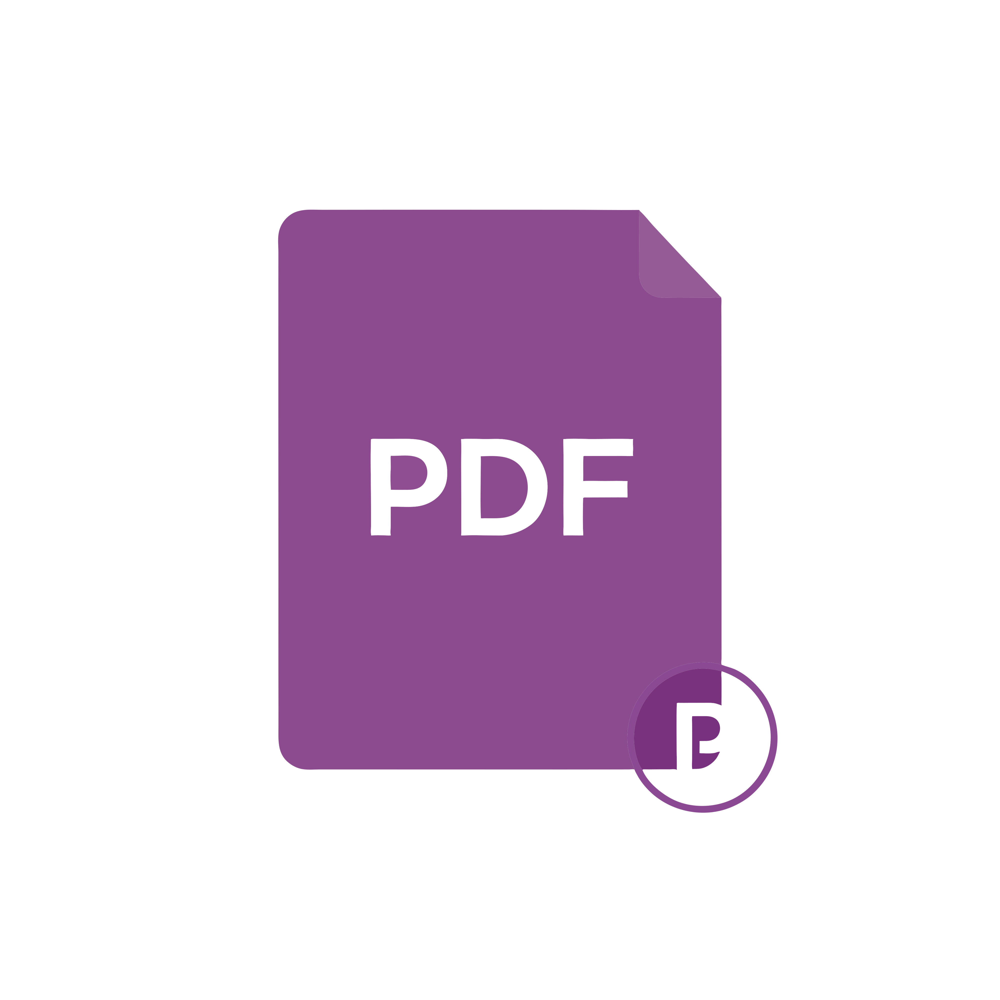

# BulkPDF

**BulkPDF** est une application de bureau performante conçue pour manipuler, optimiser et sécuriser vos fichiers PDF en masse, rapidement et en toute sécurité. 

<h1 align="center">
    <br>
      <a href="#">
        
      </a>
    <br>
      BulkPDF
    <br>
</h1>

---

## Pourquoi utiliser BulkPDF ?
La manipulation de PDF nécessite souvent des outils en ligne qui compromettent la confidentialité de vos données ou des logiciels lourds et coûteux. 

BulkPDF repose sur un **moteur de traitement local (PyMuPDF)** : aucune donnée ne quitte votre ordinateur. L'application est optimisée pour le traitement par lots, vous permettant d'appliquer la même opération sur des dizaines de fichiers en un seul clic, avec un retour visuel immédiat sur la progression et une interface moderne "Dracula" propulsée par CustomTkinter.

---

## Fonctionnalités Détaillées

L'application est divisée en plusieurs modules indépendants, tous accessibles via la barre latérale.

### 1. Fusion (Merge PDF)
Combinez plusieurs documents en un seul fichier unique.
* **Ordre personnalisé** : Importez vos fichiers et gérez l'ordre de fusion dans la liste.
* **Rapidité** : Fusion instantanée même pour des fichiers volumineux.
* **Nettoyage** : Option pour vider la liste après une fusion réussie.

### 2. Compression
Réduisez le poids de vos fichiers PDF sans perte de lisibilité.
* **Optimisation intelligente** : Réduit la taille des images internes et nettoie les données inutiles.
* **Traitement de masse** : Sélectionnez tout un dossier et compressez-le en une seule fois.
* **Indicateur de gain** : Visualisez l'espace disque économisé après traitement.

### 3. Protection (Encrypt)
Sécurisez vos documents sensibles avec un chiffrement robuste.
* **Mot de passe utilisateur** : Restreignez l'ouverture du document.
* **Mot de passe propriétaire** : Contrôlez les permissions (impression, copie de texte).
* **Chiffrement fort** : Utilise les standards de sécurité PDF pour une protection maximale.

### 4. Déverrouillage (Unlock)
Supprimez les restrictions de vos propres fichiers PDF.
* **Retrait de mot de passe** : Supprimez définitivement la demande de mot de passe si vous possédez les droits.
* **Batch Unlock** : Pratique pour traiter des archives de documents protégés par un même mot de passe.

### 5. Extraction d'Images
Récupérez tous les éléments visuels contenus dans vos PDF.
* **Export automatique** : Scanne le PDF et enregistre chaque image trouvée dans un dossier dédié.
* **Formats haute qualité** : Extraction en PNG ou JPG selon la source originale.

### 6. Paramètres
Personnalisez votre expérience.
* Choix du dossier de sortie par défaut.
* Gestion du mode d'apparence (Sombre/Clair).
* Configuration des niveaux de compression.

---

## Installation

BulkPDF nécessite **Python 3.10 ou supérieur**.

1. **Cloner le dépôt** :
```bash
git clone https://github.com/ZylosCore/bulkpdf
cd bulkpdf
```
Créer un environnement virtuel :

```Bash
python -m venv venv
# Windows :
venv\Scripts\activate
# Linux/Mac :
source venv/bin/activate
```
Installer les dépendances :
```Bash
pip install -r requirements.txt
```

2. Comment lancer l'application ?

Lancez l'application depuis la racine du projet :

```Bash
python src/main.py
```
Note : Au lancement, BulkPDF génère automatiquement une icône système haute définition (.ico) à partir de votre logo PNG pour garantir un affichage optimal dans la barre des tâches Windows.
Architecture & Sécurité

    UI : CustomTkinter (Thème sombre natif).

    Moteur : PyMuPDF (Fitz) pour une vitesse de traitement maximale.

    Image Logic : Conversion Pillow dynamique pour adapter les icônes au mode sombre (inversion en blanc automatique).

    Confidentialité : Traitement 100% hors-ligne.

# Licence

Ce projet est sous licence MIT. Voir le fichier LICENSE pour plus de détails.
